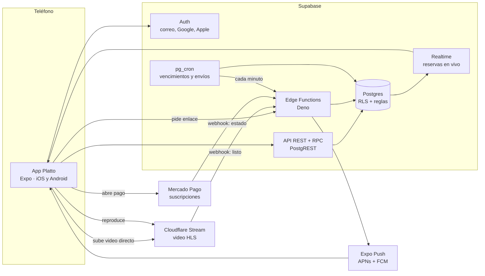

# Arquitectura

Platto usa servicios administrados para que un equipo pequeño lo opere sin servidores propios.

## Decisiones

| Decisión | Por qué |
| --- | --- |
| La lógica de reservas y calificaciones vive en Postgres (funciones `security definer`) | Una sola fuente de verdad para la app, el panel y cualquier cliente futuro; los permisos no dependen de que la app esté bien escrita. |
| Los clientes nunca escriben `reservations` directamente | El cambio de estado solo ocurre por `create_reservation`, `respond_reservation`, `cancel_reservation` y `mark_attendance`, que validan cada transición. |
| Video candidato separado del publicado | Un restaurante puede reemplazar el video de un plato sin que desaparezca mientras el nuevo se revisa. |
| Los videos van del teléfono a Cloudflare sin pasar por Supabase | Menos costo, menos latencia y el límite de 10 s se aplica en la subida misma. |
| Notificaciones en una tabla de salida (`notification_outbox`) | La base de datos decide qué avisar dentro de la misma transacción; el envío se reintenta si Expo falla y los recordatorios se programan con `send_after`. |
| Reglas duplicadas en `packages/core` | La app responde al instante (franjas, mensajes de error) sin esperar a la red; la base de datos repite cada validación. |
| Cobro de la suscripción por Mercado Pago, fuera de la tienda | Evita la comisión de Apple y Google para un servicio que el negocio usa como herramienta. Revisar antes de publicar: ver CONFIGURACION.md. |

## Modelo de datos

| Tabla | Qué guarda |
| --- | --- |
| `profiles` | Un perfil por usuario: nombre, teléfono, rol (`diner`, `restaurant`, `admin`), token de notificaciones |
| `restaurants` | Datos públicos, zona, nivel de precio, estado (`draft`, `active`, `suspended`) |
| `restaurant_members` | Quién administra cada restaurante (`owner`, `staff`) |
| `plans`, `subscriptions` | Planes Esencial y Pro, y el estado de pago de cada restaurante |
| `menu_categories`, `dishes` | Menú con precios en COP y video publicado + candidato |
| `availability_rules`, `blackout_dates` | Franjas por día de la semana con cupo de personas, y días cerrados |
| `reservations` | Solicitudes y su ciclo de vida |
| `reviews`, `review_reports` | Calificaciones verificadas, respuesta del restaurante y reportes |
| `dish_views`, `saved_dishes` | Vistas por plato (estadísticas Pro) y platos guardados |
| `notification_outbox` | Cola de notificaciones push |

## Funciones disponibles para la app

| Función | Quién | Para qué |
| --- | --- | --- |
| `discover_feed(limit, offset, zone)` | Cualquiera | Feed de platos con video aprobado, Pro primero |
| `list_restaurants(zone, cuisine, max_price, search)` | Cualquiera | Búsqueda con calificación |
| `get_available_slots(restaurant, date, party)` | Cualquiera | Franjas con cupo restante y motivo si no hay |
| `restaurant_rating(restaurant)` | Cualquiera | Promedio (con 5+ reseñas) y conteo |
| `create_reservation(restaurant, starts_at, party, note)` | Comensal | Pide una mesa |
| `cancel_reservation(id)` | Comensal | Cancela (pendiente siempre; confirmada hasta 2 h antes) |
| `respond_reservation(id, accept)` | Restaurante | Acepta o rechaza |
| `mark_attendance(id, arrived)` | Restaurante | Llegó / no llegó |
| `reply_review(id, text)` | Restaurante | Responde una reseña |
| `restaurant_stats(restaurant, from, to)` | Restaurante | Reservas, calificación y, en Pro, vistas por plato |
| `review_dish_video(dish, approve, note)` | Admin | Aprueba o rechaza un video |
| `set_review_hidden(review, hidden)` | Admin | Oculta una reseña reportada |

Los errores de negocio llegan con un código estable en el mensaje (`SLOT_FULL`, `TOO_SOON`, `CANCEL_TOO_LATE`…); la app los traduce con los textos de `packages/core`.
